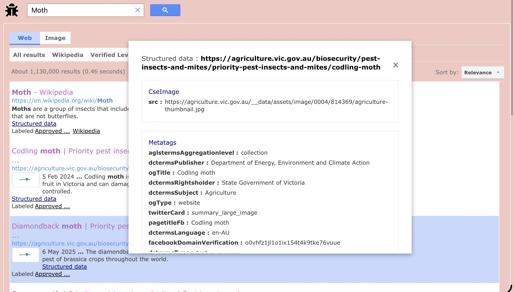

# Supported Schema.org, meta tags and other markups with BugSearch

Using Schema.org types alongside our other search tools can help you enhance your site visibility, for example providing information, giving summaries, and getting site visits. Some types are here right now, but others will be added in the future. You will also see other tips and tricks that you can use that is not only schema.org types.


Misuse of Schema.org types, meta tags, and other markups BugSearch provides to it’s publishers for the purpose of getting an unfair advantage over other sites, or manipulating search rankings will result in manual actions such as search demotions, search blacklisting (for the whole site or chosen pages), and other punishments. If it is that bad, it may get your BugSearch publisher account suspended along with all your other linked sites getting banned, and any members that you delegated admin access to will also get banned.



Any updates you make to the Schema.org markup, meta tags or related markups will take effect on not only BugSearch but other search engines as well, if they support it. BugSearch exclusive markups don’t count towards other search engine.


## Schema.org markup - Let people learn more about your site with Data Modals

You can use any schema.org type and it will appear in a Data Modal alongside any other markups that change the appearance of your search result. you don’t need to code anymore, it will update the next time we index your site.

You can test your Data Modal by searching your site name (or url, if it does not show up) and pressing Structured Data under the result.

Data Modals do not show up on Highlighted Results (or promoted search) but they still show up when you access it normally.

You can learn more about how to make your Data Modal at https://schema.org. Note that if the schema type is supported in Bugs+, it will affect the visual appearance of the search result.

<figure><figcaption>
Real life example of a Data Modal
</figcaption></figure>

## Thumbnails

Thumbnails can be added.

## Action Bars


This feature will come in a future version of BugSearch

